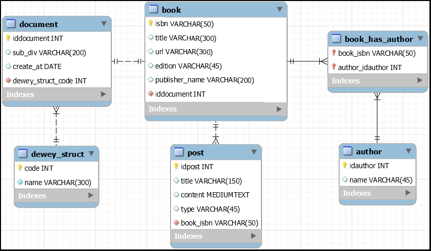
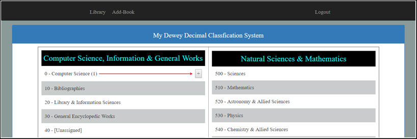
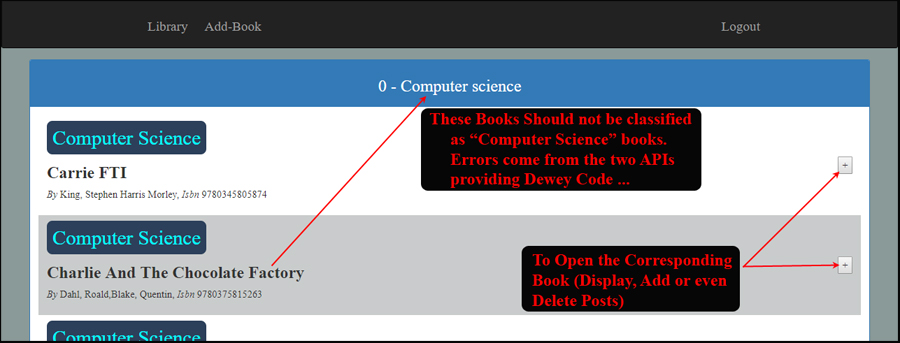
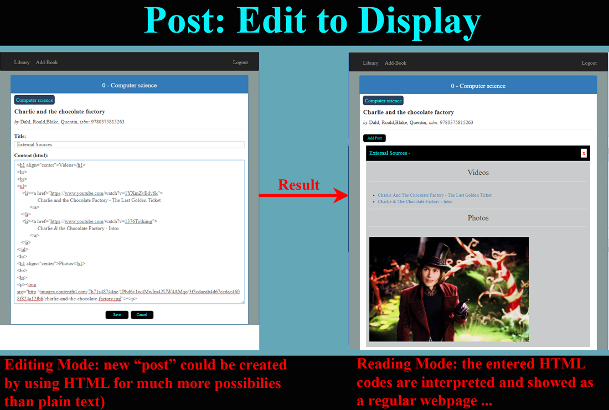
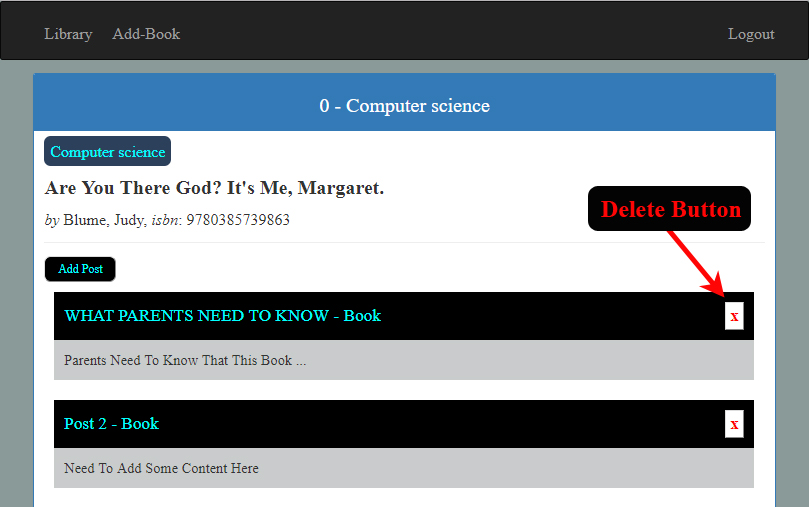

# My Dewey Decimal Classification System - 1 of 5 - Books. Authentication with Auth0

## Goal
"**Books**" is 1/5 part of "**My Library**" with "**Quotes**" ([here](https://github.com/DinhLeGaulois/dewey_2of5_quotes)) and "**quiz**" ([here](https://github.com/DinhLeGaulois/dewey_3of5_quizzes)) are two other parts (the 2 last parts won't be published: "**authentication/authorization**" and "**free-style**" document). The final project (database with 26 tables, well "**normalized**") allows users to manage all their digital studied subject with the same environment (**ebooks**, **audios**, **videos**, **documents** - **html**, etc. - **images**, **quizzes**, etc.) The application could be use collectively or privately (authorization is strict). A student could centralize all study's subjects for a given semester in his (or her) favorite list and work exclusively on it. Later, next semester for example, the person could build another list very easily with all things that he (or she) needs.

## Technologies
> + **Authentication**: Auth0
> + **Front-end**: Angular 2,
> + **Back-end**: Express/NodeJS
> + **Datasource**: MySQL

## Authentication and Authorization
"**Auth0**" will be used for authentication. **Authorization** will be setting up to control the access to **routes** ...

### Installation:
- **angular2-jwt** (npm install angular2-jwt --save)
- **auth0-lock** (npm install auth0-lock --save)
	 

## Data Source
  - **mySQL**: containing complex structure to manage correctly information. No "**ORM**" is used, all codes are "pure" SQL's language. Why? Because some programmer pretends that "**ORM**" could not be used for complexes requests (but mostly, much more challenging to program, so, very interesting ...)
  - external **API**s to get information (title, authors, publication's date, number of pages, etc) from **ISBN**: "**Open Library Books**" and "**isbndb**",

## The EER (enhanced entity-relationship)

## User Interface
### Library - Main Interface (after logged in, controlled by Auth0)

### Listing the books on sub-division
Note: Dewey's codes are sometimes wrongly assigned by the two APIs ("**Open Library Books**" and "**isbndb**"). Maybe the API from **Amazon** could be the better quality? The problem could be fixed very easily in the **api-routes** in the server-tier.

### Post: Add and Display
**Important:** this part is the goal of the project. We want to edit information in HTML with all possibilities that we could do: adding links to videos (from **Youtube**, for example), pictures (anywhere from the Internet or from our computer), audios, text, etc. Everything is perfect? NOOOOOOOOO, **BE AWARE**: this is the best way to be hacked by "**Script Injection**", so, how could we avoid being hacked? No idea because if we don't display HTML code as ... HTML code (we could display it as plain text, without any interpretation) then we are losing the goal of the project: create very rich content easily ... 

### Display a Book's Posts

## Execution (development's mode)

> 1. **SQL database**: execute the [model](https://github.com/DinhLeGaulois/myDeweyDecimalSystem/blob/master/server/sql_model/sql_model.sql) (create **database** and/or **tables** and/or **procedures** if not existed)
> 2. Set up the configuration to get access to YOUR Database ([here](https://github.com/DinhLeGaulois/myDeweyDecimalSystem/blob/master/server/config/connection.js)). In this case, you must enter YOUR password (to your database)
> 3. In a terminal, execute "**npm run build**"
> 4. Open an Internet Browser, enter "**localhost:3000**"

## Problem
Dewey's codes from "**Isbndb**" and "**openlib**" are supposed to be accurate and could be considered as reference. However, we could see easily that most of books are given the number between 0 and 9 (which belongs to **Computer Science**). We could try other APIs (from **Amazon** for example) to get better result ...

## Important Files ...
> * Create database, set it in "Use", create tables and add Dewey code and name ([here](https://github.com/DinhLeGaulois/myDeweyDecimalSystem/blob/master/server/sql_model/sql_model.sql))
> * Set up the configuration to get access to YOUR Database ([here](https://github.com/DinhLeGaulois/myDeweyDecimalSystem/blob/master/server/config/connection.js))
> * All request to database server (MySQL) could be see ([here](https://github.com/DinhLeGaulois/myDeweyDecimalSystem/blob/master/server/routes/api-routes.js))

## Author
* Dinh HUYNH - All Rights Reserved!
* dinh.hu19@yahoo.com
